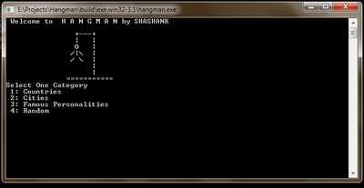

## Adam Asmaca Oyunu (Hangman)
Bu oyunu zamanında hepimiz oynamışızdır. Bu proje için random ve string kütüphanelerini kullanabilirsiniz. Burada kelimelerimizi words.py isimli bir dosyada tutabiliriz. Sonrasında eğitim sürecinde öğrendiğimiz dosya işlemleri ile oluşturduğumuz listeyi ana projede kullanabiliriz. Hatta size bir ipucu! 
word = [“kelime1”, “kelime2”, “kelime3”,...] (Araştırabilirsiniz)

Özetle, programımız random bir kelime seçecek ve bizde terminalden harfler girerek adamımız asılmadan bu kelimeyi bulmaya çalışacağız. Adam asılınca oyun bitecek. Eminim bu projeyi yaparken çok eğleneceksiniz. Aşağıdaki resim size yol gösterebilir.

