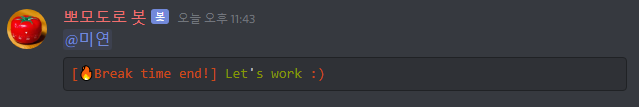
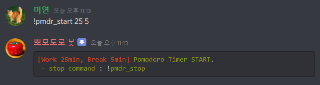
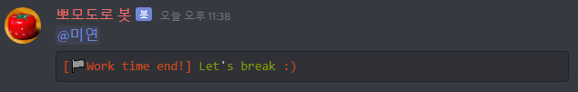
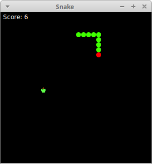

# Python 101 Temmuz Dönemi Projeleri

## 1) Sihirli Discord Botu

Bu projede sizden belirlediğiniz bir zaman aralığı kadar geri sayım yapıp, çalar saat görevi gören bir Discord botu yazmanız. Örnek olarak, botunuzun süresini 40 dakika olarak ayarlarsanız, başlatıldığı saatten 40 dakika sonrasında sizi mesajla uyarmalı. Projeyi yaparken **discord.py** kütüphanesinden yararlanmalısınız.

## 2) Yılan Oyunu

Bu projede bir yılan oyunu kurgulmanızı istiyoruz. Yem peşinde olan bir yılanımız var. Yemi yedikçe yılan büyüyecek. Burada arayüz boyutu width = 500 and height = 500
cols = 25 and rows = 20 şeklinde olabilir. Tabii ki tamamen size kalmış. Projeyi yazarken math, random, pygame (draw, key module vs.), tkinter, tkinter.messagebox libraries
gibi kütüphaneleri kullanabilirsiniz. Bol bol araştırma yapın! Örnek olarak aşağıdaki görsel size yol gösterebilir.

## 3) Adam Asmaca Oyunu (Hangman)
Bu oyunu zamanında hepimiz oynamışızdır. Bu proje için random ve string kütüphanelerini kullanabilirsiniz. Burada kelimelerimizi words.py isimli bir dosyada tutabiliriz. Sonrasında eğitim sürecinde öğrendiğimiz dosya işlemleri ile oluşturduğumuz listeyi ana projede kullanabiliriz. Hatta size bir ipucu! 
word = [“kelime1”, “kelime2”, “kelime3”,...] (Araştırabilirsiniz)

Özetle, programımız random bir kelime seçecek ve bizde terminalden harfler girerek bu kelimeyi bulmaya çalışacağız. Eminim bu projeyi yaparken çok eğleneceksiniz. Aman dikkat adam as
